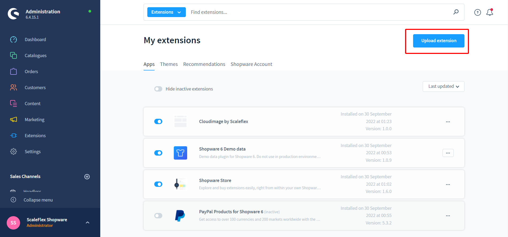
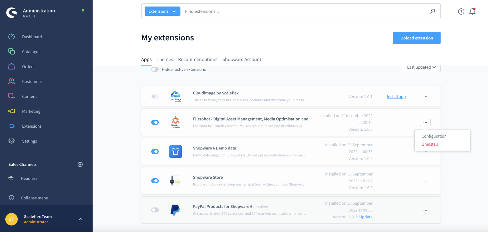
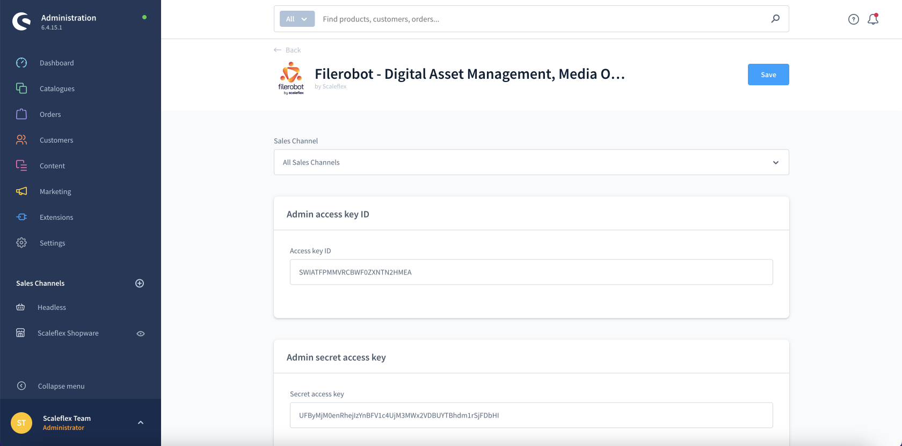
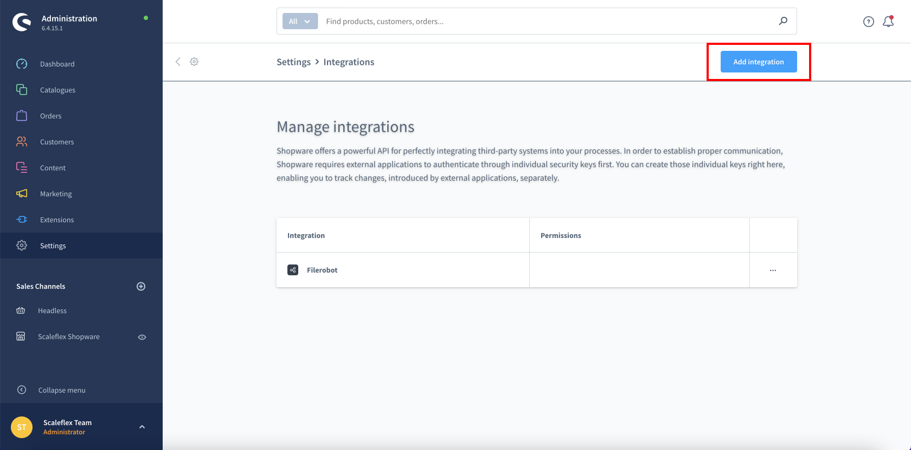
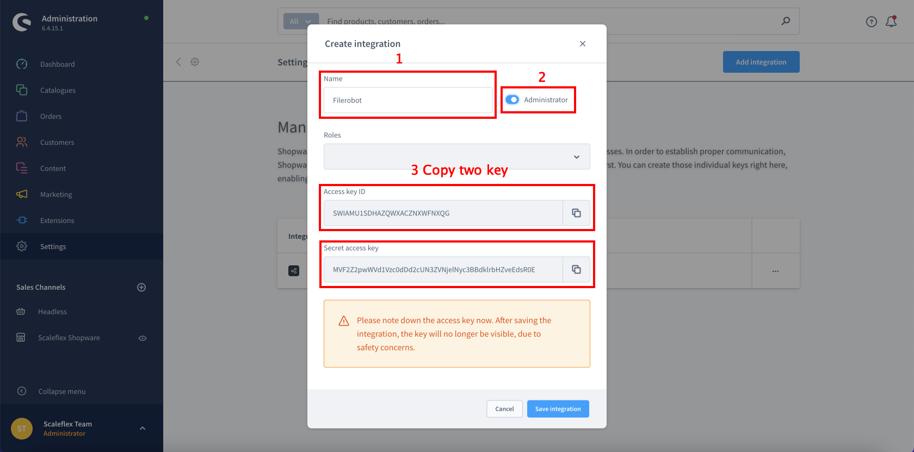

# Filerobot Module

## Download and Installation the Filerobot module

- Step 1: Download the latest version [Download Latest release of Module](https://github.com/scaleflex/shopware-filerobot-plugin/releases)
- Step 2: Zip the file with the name "filerobot.zip"
- Step 3: In Admin go to Extensions -> My extensions -> Upload extension
  

## Installation with Shopware store

- Step 1: In Admin go to Extensions -> Store -> Catalog search for "Filerobot by Scaleflex"
- Step 2: Click into extension and after that "Add extension"
- Step 3: Go to Extensions -> My extensions -> "Filerobot by Scaleflex - Digital Asset Management, Media Optimisation and Acceleration" -> Click on "Configuration"
  
- Step 4: Update configuration and activate the Module, then your site is ready to go.
  

## Configuration
- **Admin access key ID:** Need to generate in "Setting" to call API in Admin Dashboard.
- **Admin secret access key:** Need to generate in "Setting" to call API in Admin Dashboard.
- **Folder Id:**  This key will auto generate when the plugin activate.
- **Activation**: Enable/Disable the module
- **Token**: Please enter your Filerobot token here (eg: abcdefgh)
- **CNAME**: Enter the CNAME as per the configuration done in your Filerobot Asset Hub interface, once validated and the SSL certificate is accepted. (Or leave blank if none).
- **Security Template Identifier:** To load the Filerobot Widget or Filerobot Image Editor, you need to create a Security Template in your Filerobot Asset Hub first, in order for your Shopware instantiation of the Filerobot Widget to obtain proper credentials and access your storage.
- **Filerobot upload directory:** The directory in your Filerobot account, where the files will be stored.

####  The step to get **"Admin access key ID"** and **"Admin secret access key"**:

